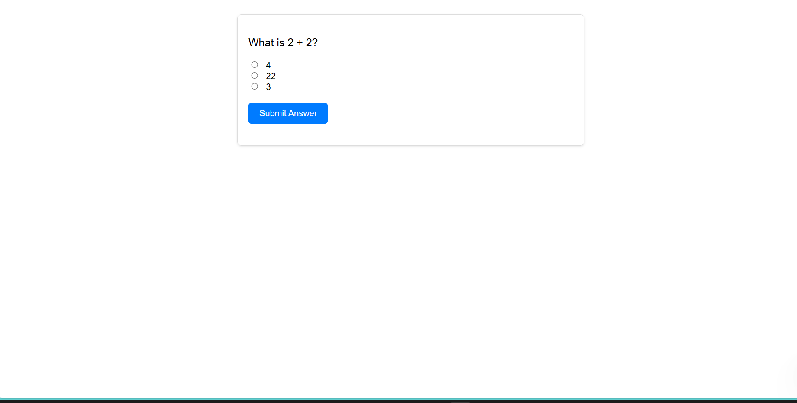

# ALX Simple Quiz

A simple and interactive quiz application developed using HTML, CSS, and JavaScript. This project was built as part of the ALX Front-End curriculum to practice DOM manipulation and basic interactivity in JavaScript.

## Features

- Multiple-choice questions
- Score tracking
- Immediate feedback on answers
- Simple and clean UI

## Technologies Used

- HTML5
- CSS3
- JavaScript (Vanilla)

## Live Demo

[View Live](https://abdul-rahmannasser.github.io/ALX_Simple_Quiz/)

## Screenshot

 <!-- Add a screenshot if available -->

## License

This project is licensed under the MIT License.
